# QMULATE — Testing strategy and hands-on testing guide

*Written 2026-09-09 at `main` after the Sprint 12 merge (`b87552b`; CI run `34369010748`, all eight jobs green). Screenshots were taken on the fixture seed of that commit. Everything in this document is fixture-only: every name, number, e-mail and password below is a published, invented constant from `data/fixtures/sample-waqf.json` and `packages/database/src/seed/`. Nothing here is a secret, and nothing here is real client data.*

This document does two jobs:

1. **Testing strategy** — what the automated suites are, what each layer proves, how to run them, how to read a CI verdict, and where the coverage gaps are (§1–§3, §9).
2. **Hands-on tutorial** — how to stand up the app locally, sign in as each seeded user type, and where to go to test each feature, with screenshots and the expected result (§4–§8).

---

## 1 · The testing pyramid as it exists in this repo

```
            E2E (Playwright, ar + en)          14 spec files · 49 tests × 2 locales = 98
        ─────────────────────────────────
        Integration (real PostgreSQL)          96 files: database + api + jobs + worker
     ──────────────────────────────────────
     Guardrail (G-8, subprocess-driven)         2 files: residency + importer
  ────────────────────────────────────────────
  Unit (vitest, per workspace, no database)    96 files across 11 workspaces
```

| Layer | Where | What it proves | Runs against |
|---|---|---|---|
| **Unit** | `packages/*/test`, `apps/web/test`, `packages/domain/src/**/__tests__` | Pure logic: the distribution engine (thousands of enumerated runs), the compliance/deadline engine, the access matrix, i18n catalogue parity, the Arabic floor, schema/vocabulary parity pins, env schema, rate-limit posture | nothing external |
| **Integration** | `*.integration.test.ts` in `packages/database`, `packages/api`, `packages/jobs`, `apps/worker` | The database as a *constraint system*: guard triggers, privilege separation (ADR-0008), write-once Shart, append-only audit, maker≠checker, the approval-decision plane, onboarding gates, birth admission, the importer; the tRPC procedure ladder and scoping | a migrated + seeded PostgreSQL with the three roles provisioned |
| **Guardrail (G-8)** | `packages/database/test/residency-guardrail.test.ts`, `import-guardrail.test.ts` | Seed refuses anything but `fixture-only`; importer refuses anything but `production` + `ksa`; never both | subprocesses of the real seed/import CLIs |
| **E2E** | `apps/web/e2e/*.spec.ts` | What a *screen shows* to a *seated* user, in both locales: the journeys in §7, deny-by-default, RTL, no raw keys leaking | a production `next start` build over a seeded database |

**Why the pyramid is shaped this way.** The product's invariants (corpus never distributed, Shart immutable, `SHART_INCOMPLETE` halts, maker ≠ checker, access matrix holds) are enforced in the **database** with `ENABLE ALWAYS` triggers and privilege separation, not in application code. So the integration layer is unusually heavy and unusually important: a unit test of a TypeScript function cannot prove a trigger fires. E2E is deliberately thin — one journey per feature, both locales — because its job is to prove the *screen* tells the truth, not to re-prove the engine.

**Two verification rules the suites follow, and manual testers should too:**

- **Green positive control before every negative.** A refusal is only evidence if the same path *succeeds* for the entitled seat in the same run. Every suite asserts both halves; when you test by hand, do the same (§7 pairs each negative with its positive).
- **A claim about what a screen shows is a different class from a claim about what a function returns.** The API can be right and the page can still render a zero where it should say "read refused". Check the words on the screen.

## 2 · Running the suites

All commands run from the repo root. There is no Docker on the reference machine; `scripts/dev-postgres.ts` runs an embedded PostgreSQL. CI uses a real `postgres:16-alpine` service container and is the source of truth.

### 2.1 Fast lane (no database) — run before every push

```bash
pnpm typecheck && pnpm lint && pnpm format:check && pnpm test
```

`pnpm test` is turbo-driven across **all** workspaces. Do not hand-pick packages: S12's first CI red was a unit suite in `@qmulate/auth` that had not been run locally because six packages were run by hand and the seventh was skipped.

### 2.2 Integration — the canonical sequence

```bash
pnpm exec tsx scripts/dev-postgres.ts --name it --port 54461 --reset --run "pnpm exec tsx scripts/provision-db-roles.ts && pnpm --filter @qmulate/database run migrate:deploy && pnpm run db:seed && pnpm test:integration"
```

Rules that cost real time when broken:

- **`--reset` alone runs the suites against an unmigrated cluster** and reports dozens of files red on `42P01 relation does not exist`. That is the harness, not the code. The four-step chain above (provision → migrate → seed → test) is the only correct order.
- **Integration BEFORE E2E on the same cluster, or use `--reset`.** The E2E leg leaves state behind (born endowments, enrolled TOTP, cleared gates). Some tables are write-once (`42501`), so a second run on a dirty cluster fails for reasons that have nothing to do with the code.
- **Use isolated, named clusters** (`--name`, `--port`). Never share a cluster between two concurrent sessions.

### 2.3 Guardrail (G-8)

```bash
pnpm test:guardrail
```

No database needed; it spawns the seed and importer CLIs and asserts their refusals by exit code and message.

### 2.4 E2E — the one-command local leg

```bash
pnpm test:e2e:local-fixture-only
```

This resets a cluster, provisions, migrates, seeds, **builds `apps/web` cold**, starts `next start` on **port 3000**, and runs Playwright with `CI=1` in both locales. It refuses to start if port 3000 is taken. Port 3000 is the harness's port: **keep human-facing servers off it** (§4 uses 3100) and never set `reuseExistingServer`.

The E2E server is the *production* build on purpose: `next dev` restarts itself when the V8 heap crosses 80 %, and for seven CI runs that restart was silently absorbed by a retry. `apps/web/e2e/web-server.mjs` now fails the run if that ever happens again.

### 2.5 The CI verdict

CI has eight jobs: Typecheck · Lint · Unit tests · Build · Integration tests · Residency guardrail (G-8) · E2E (Playwright, ar + en) · Deploy → staging (Railway). Take the verdict from the API, never from the log and never from a job's conclusion alone:

```bash
gh run view <run-id> --json status,conclusion,jobs --jq '.status, .conclusion, (.jobs[] | "\(.name): \(.status)/\(.conclusion)")'
```

**The deploy job reports `success` on `main` while deploying nothing.** Its guard step passes and then *Enable corepack / setup-node / Install dependencies / Deploy / Apply migrations on staging* are all `skipped` because no Railway token is configured. Read it **per step**:

```bash
gh run view <run-id> --json jobs --jq '.jobs[] | select(.name|startswith("Deploy")) | .steps[] | "\(.name) → \(.conclusion)"'
```

A push to a branch **cancels the in-flight run** for that branch (`cancel-in-progress: true`). If you need a run's evidence, wait for it before pushing again.

## 3 · What each gate and scenario is proven by

The Definition of Done (`docs/product/prd/17-build-ship-dod.md`) names release gates G-1…G-10 and verification scenarios V-1…V-12. Where they live:

| Gate / scenario | Proven by | Manual check (§7) |
|---|---|---|
| **G-1 Audit immutable** | database integration: `UPDATE`/`DELETE` on `audit_event` refused at the DB | — (no UI; the trail is read via the API) |
| **G-2 No commingling** | migration 19's composite FKs + integration suite | Financials screen: every receipt on a dedicated account (§7.8) |
| **G-3 Maker ≠ checker** | database + api integration (`SEGREGATION_OF_DUTIES`), `distribution.spec.ts` | Submit a run as the accountant, approve as a *different* Nazir (§7.7) |
| **G-4 KYC gates distribution** | domain engine tests, `distribution.spec.ts` (`KYC_UNVERIFIED` line withheld) | Wizard lines step on `waqf-001`, `ben-003` is *Withheld* (§7.7) |
| **G-5 Statutory deadlines** | domain calendar tests, `compliance-journey.spec.ts` | Dashboard board for `waqf-003` is red on the overdue certificate update (§7.1) |
| **G-6 AML no-tipping-off** | database + api integration (compartment subtraction) | GOV-AML-02 is invisible on every register outside the compartment |
| **G-7 Access matrix holds** | `kernel.spec.ts`, `endowment.spec.ts`, `grant-escalation` and `router-introspection` pins | Sign in as `unscoped@` and `beneficiary.ben-001@` (§7.9) |
| **G-8 Residency guardrail** | `pnpm test:guardrail` + CI steps G-8a…f | Run the importer CLI locally and watch it refuse (§8) |
| **G-9 Distribution integrity** | ~2,160 domain tests incl. enumerated runs; invariants I1–I8, I-R1 | Wizard review step lists the invariants asserted (§7.7) |
| **V-1** corpus excluded from a run | `distribution.spec.ts` | `rev-005` (istibdal proceeds) visibly excluded on the review step |
| **V-11** Gate 02 blocks a run and a filing | `onboarding-gate.spec.ts`, api + database gate suites | §7.5 |
| **V-12** importer refuses a non-KSA / non-production target | `import-guardrail.test.ts` (15) + `import-apply` integration (4) | §8 |

## 4 · Stand up a local environment for manual testing

**Prerequisites:** Node 22, pnpm (corepack), `pnpm install` done once. No Docker needed.

One command starts a throwaway PostgreSQL, provisions the three database roles, applies all 54 migrations, seeds the fixture, and starts the web app on **port 3100**:

```bash
pnpm exec tsx scripts/dev-postgres.ts --name manual --port 54460 --reset --run "pnpm exec tsx scripts/provision-db-roles.ts && pnpm --filter @qmulate/database run migrate:deploy && pnpm run db:seed && env -u MIGRATOR_DATABASE_URL -u SUPERUSER_DATABASE_URL -u PGBOSS_DATABASE_URL BETTER_AUTH_URL=http://localhost:3100 NEXT_PUBLIC_APP_URL=http://localhost:3100 PORT=3100 pnpm --filter web exec next dev --port 3100"
```

Then open <http://localhost:3100/en/sign-in> (or `/ar/sign-in`).

Why the command looks like that:

- `dev-postgres.ts --run` injects five database URLs into the child (`DATABASE_URL` for `qmulate_app`, `ACCESS_MATRIX_DATABASE_URL`, `MIGRATOR_DATABASE_URL`, `SUPERUSER_DATABASE_URL`, `PGBOSS_DATABASE_URL`) and pins `DATA_CLASSIFICATION=fixture-only`.
- The migrate and seed steps need the owner/superuser URLs. **The web app refuses to boot if it can see them** (ADR-0008 round 6, `apps/web/src/instrumentation.ts`) — that is a designed guard, not a bug — so `env -u …` strips the three non-runtime credentials before `next dev` starts. If you forget, the log says `apps/web refuses to boot: privilege separation` and the command exits 0.
- Port 3100, not 3000: 3000 belongs to the Playwright harness (§2.4).
- Re-running **without** `--reset` keeps your data (enrolled TOTP, cleared gates, born endowments). Re-running **with** `--reset` gives you the pristine fixture again.

The seed prints what it wrote. On this commit: 14 users, 12 credential accounts, 1 client, 3 founders, 6 endowments, 30 beneficiaries, 9 transactions, 1 historical distribution, 50 compliance obligations, 4 deadlines, 47 access grants, 1 pending approval request; 283 audited writes. It also prints the admin login and the one sentence you need for §5: *"TOTP enrolment is required on first sign-in."*

## 5 · Sign in: password + TOTP (every account, every time)

Every seeded operator shares one fixture password:

```
fixture-only-not-a-secret-9271
```

### 5.1 First sign-in enrols a second factor (one-way door)

1. Open `/en/sign-in`, enter the e-mail and the password above, submit.

   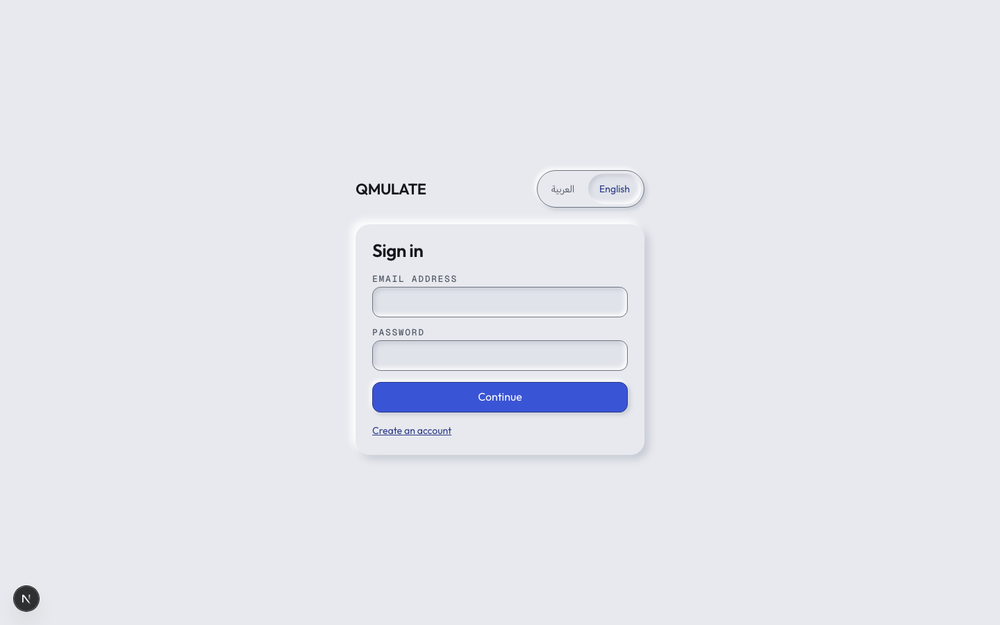

2. You land on `/en/two-factor` in the **enrol** phase. Two-factor is mandatory; you cannot reach the app without it. Re-enter the same password to start enrolment.

   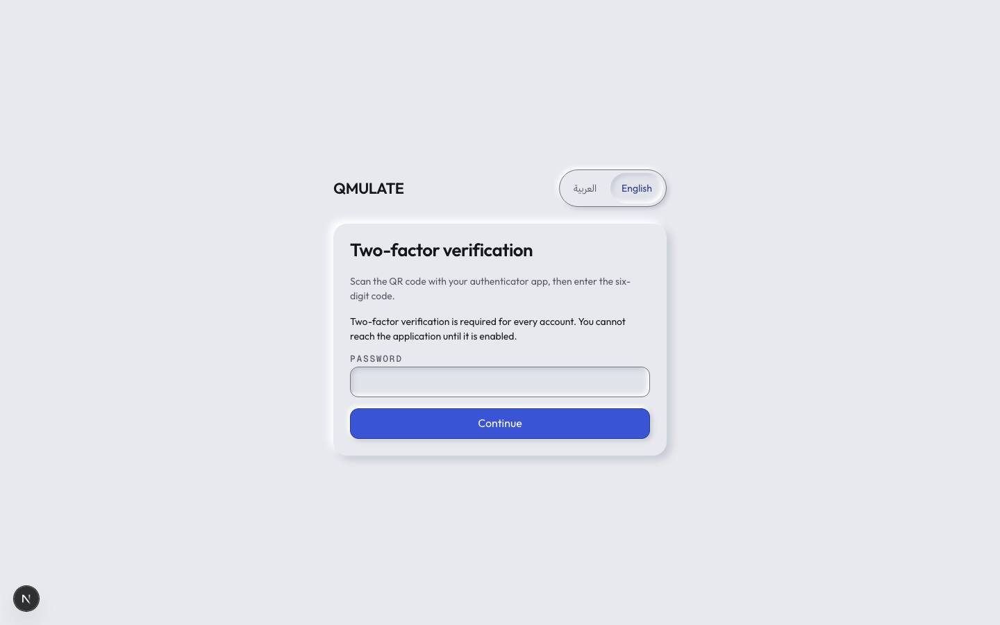

3. The page shows an `otpauth://` URI and ten recovery codes. Copy the recovery codes somewhere: they are shown once.

   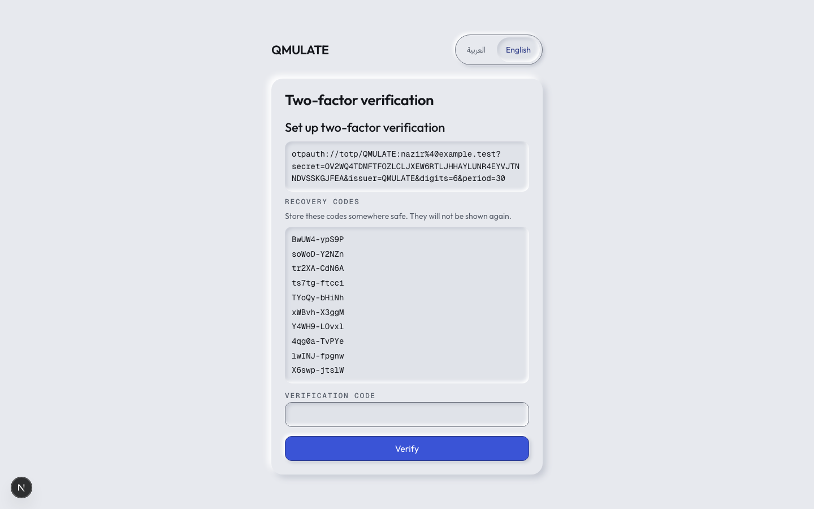

4. Turn the URI into a six-digit code and submit it. Either:
   - **Authenticator app:** in Google Authenticator / 1Password / Authy choose "enter a setup key" and paste the `secret=` value from the URI (the account name is the e-mail, issuer `QMULATE`, 6 digits, 30 s). The UI's copy says "scan the QR code", but the screen renders the URI as text, not as an image — pasting the secret is the working path today (see §9 gaps).
   - **Helper script (this folder):**

     ```bash
     node docs/testing/totp.mjs 'otpauth://totp/QMULATE:nazir%40example.test?secret=…&issuer=QMULATE&digits=6&period=30'
     ```

     prints the current code. Keep the URI; you need it on every later sign-in.

5. On success you are on `/en/dashboard`.

**Enrolment cannot be repeated for the same user** — better-auth returns the secret exactly once. If you lose the secret and the recovery codes, the only way back in as that user is `--reset` on the cluster (§4). Every later sign-in goes password → six-digit code.

### 5.2 Sign-up

`/en/sign-up` creates a new account. It has **no grants**, so it behaves exactly like `unscoped@example.test` (§7.9): it can sign in and enrol TOTP, and then is told nothing about the portfolio. Seats are issued by the matrix administrator through the API, not by self-service.

## 6 · The seeded users — who to sign in as

All twelve credential accounts use the password in §5. "Scope" is the set of endowments the seat holds a grant on; a screen for any other endowment answers *That record was not found* (`NO_GRANT` — deliberately indistinguishable from a non-existent record).

| Sign in as | Role preset | Scope | Use it to test |
|---|---|---|---|
| `nazir@example.test` | **NAZIR** (42 verbs) | all six endowments | Everything an operator does: read every record, approve and sign runs, approve reserved matters, reopen a cleared onboarding gate, record maintenance policy. The primary trustee. |
| `approver@example.test` | **NAZIR** (second holder) | all six | The **distinct checker**. Approving a run the accountant submitted, when `nazir@` raised nothing. Two Nazir seats exist by product decision (PO-2): approval authority is role-level, maker ≠ checker is the invariant. |
| `accountant@example.test` | **FINANCE** | all six | The **maker**: compute, review and submit a distribution run; record receipts and bank movements (API); read financials. Cannot approve. |
| `matrix-admin@example.test` | **SYSTEM_ADMIN** | `waqf-001` | **Register an endowment** (intake) for the family it already serves; issue seats (API). The only holder of `admin:access_matrix:write`. Cannot approve or sign anything. |
| `clerk@example.test` | **COMPLIANCE_OFFICER** | `waqf-004` | **Clear onboarding gates**, **record reserved-matter chain steps** (principal consent, counsel review). The staff seat of the S12 journeys. |
| `compliance@example.test` | CASE_MANAGER preset, compliance duty | `waqf-003`, `waqf-004`, `waqf-007` | The **compliance board** in three states (red / open / not computable); discharging a registration duty on the endowment record. |
| `case-manager@example.test` | **CASE_MANAGER** | all six | Deed **read**; endowment record work; distribution *initiate* without approve. |
| `auditor@example.test` | **AUDITOR** | `001, 003, 004, 005, 007` | **Read-only financials**; every write refused; every refused read stated in words. |
| `board@example.test` | **FAMILY_BOARD** | all six + the client membership | The family's read-only view of its endowments and the approvals queue. |
| `beneficiary.ben-001@example.test` | **BENEFICIARY** | `waqf-001`, own record `ben-001` only | Scope walls: sees only its own endowment's deed and its own line items; never co-beneficiaries, never the ledger. |
| `admin@example.test` | SYSTEM_ADMIN, **no endowment grant** | none | Platform-level admin. Proves that admin authority is not an endowment grant: endowment screens answer not-found. The E0 exit subject. |
| `unscoped@example.test` | none | none | The **negative control**. A valid session with zero grants must see nothing. Never give it a grant. |

Two more seeded users have **no credential account by construction** and cannot sign in: `service.deadline-sweeper@example.test` (the declared non-human service seat that runs the deadline sweep) and `control.sweep-coverage@example.test` (a sweep-coverage control). They exist so the worker's context can be built in-process, and so a test can prove nobody can log in as them.

### 6.1 The seeded endowments (the subjects you will point at)

One fictional client, *Al-Rashidi Family (fictional)*, three founders, six endowments. Certificate numbers are `FAKE-100000n`.

| id | Certificate | Type / size | Why it exists |
|---|---|---|---|
| `waqf-001` | FAKE-1000001 | family (dhurri), medium, **ORDERED** entitlement | The V-1 / G-9 subject. Has the historical run `dist-001`, the corpus receipt `rev-005` (istibdal proceeds, never distributable), a KYC-unverified beneficiary (`ben-003`), and the overdue REGISTER_30BD deadline. |
| `waqf-002` | FAKE-1000002 | family, small, SHARED | The healthy registration (discharged on time); a deed silent on the Nazir fee. |
| `waqf-003` | FAKE-1000003 | **public charitable**, large | Three charitable jihas at 40/30/30; the **red compliance board** (overdue certificate update, UPDATE_15BD). |
| `waqf-004` | FAKE-1000004 | family, small, **direct use** | The S12 subject: **Gate 02 open** (V-11), the clerk's endowment, the reserved-matter chain journey, the direct-use financial statement. |
| `waqf-005` | FAKE-1000005 | family, small, LINEAGE | **Intake state**: its مآل (reversion) clause is unread, so a distribution run **halts** (`REVERSION_CLAUSE_UNREAD`). Carries the 16-member, three-generation lineage tree. |
| `waqf-007` | FAKE-1000007 | family, small, LINEAGE | The computing lineage sibling (four-member tree, `zuhur_only`). Registration anchor recorded but outside calendar coverage. |

## 7 · Where to test what — feature by feature

Every route is locale-prefixed: swap `/en/` for `/ar/` to test the Arabic, right-to-left rendering of the same screen. The sidebar's greyed items (Beneficiaries & UBO, Compliance, Calendar, Documents, Audit Log) are rendered but **not linked** — they are not built (§9).

### 7.1 Dashboard and the compliance board

**Route:** `/en/dashboard`, `/en/dashboard?waqf=<id>` · **Who:** any seated user; what renders depends on the seat's verbs.

Sign in as `nazir@example.test`. The dashboard shows two KPI tiles (runs awaiting approval, distributions past their deadline — the latter flagged *unverified figure*), the endowments in scope, a one-line roll-up per endowment (each carries the worst of its five indicators), and the **compliance board** for the selected endowment: five zero-tolerance indicators, the statutory deadline table (one line per rule; a rule with no row says *why*), decisions required, KYC freshness, AML reporting, government filings.

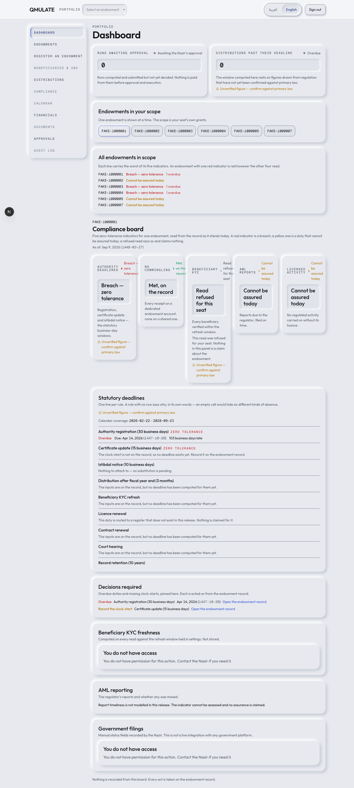

**What to check:**

- Select `FAKE-1000003` (`waqf-003`). The Authority-deadlines indicator is **red**: *Certificate update (15 business days) — Overdue, due Jun 9, 2026 (1447-12-23)*. Every regulatory figure carries the *⚠ Unverified figure — confirm against primary law* marker (Binding rule 3).
- An indicator a seat cannot read says **"Read refused for this seat"** in words. It never renders a zero or a green light for a fact it was not allowed to read. Compare the same board as `compliance@example.test`:

  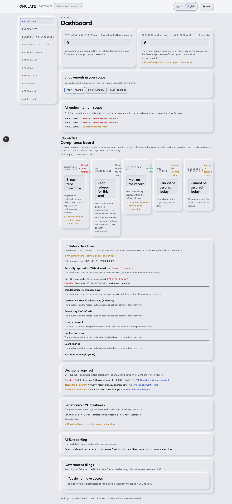

- `waqf-007` says *Cannot be assured today*: its registration anchor is recorded but falls outside the seeded holiday calendar, so the deadline is **not computable** — the board says so rather than guessing.
- Dual calendar everywhere: every date is Gregorian with the Hijri in parentheses.

**Arabic:** `/ar/dashboard` — the whole layout mirrors, the light source flips, Arabic labels are never uppercased or letter-spaced, and credential fields stay LTR islands.

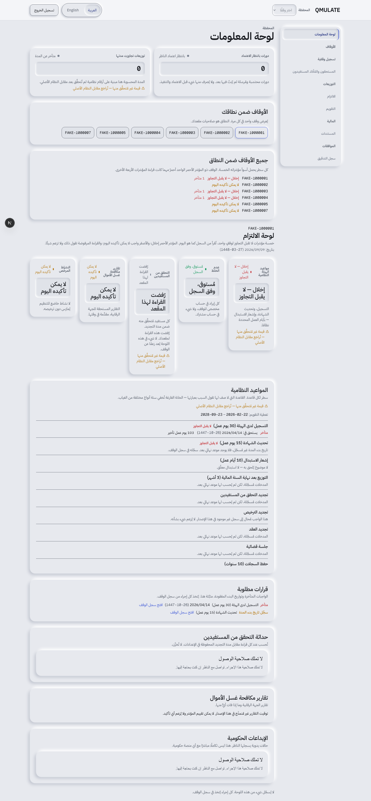

**Automated:** `compliance-journey.spec.ts`, `shell.spec.ts`, the compliance engine's unit suite.

### 7.2 Endowments: the record and its tabs

**Route:** `/en/endowments` → `/en/endowments/<waqfId>` · **Who:** any seat holding `endowment:waqf:read` on that endowment.

The list renders the hierarchy client → founder → endowment. The record page has tabs: **Record · Trusteeship deed · Classification · Founder's conditions · Beneficiaries · Reserved matters · Onboarding**. A tab the seat holds no verb for is refused on that tab while the others still read.

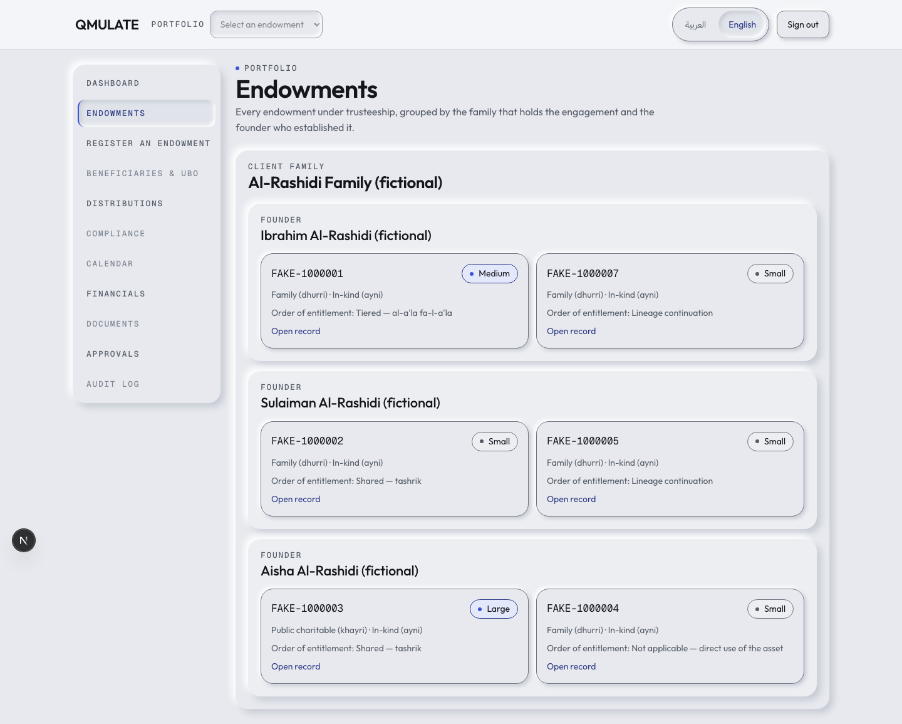

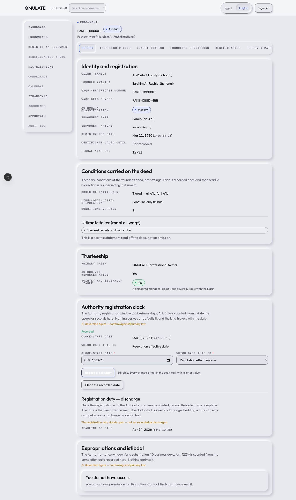

**Trusteeship deed** (`/deed`): the primary Nazir and the authorised representative, joint-and-several liability stated. There is **no edit**: a recorded appointment is superseded by a court instrument, never edited (owner ruling, memo Q10). `case-manager@` and `beneficiary.ben-001@` can read this tab on `waqf-001`.

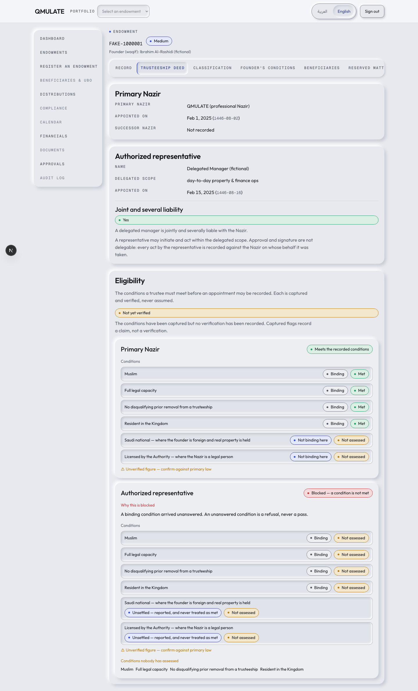

**Classification** (`/classification`): size class and direct-use flag as two independent axes; the duties this class gates and the ones it excludes; **no settled band figure** (the SAR 200M / 50M thresholds are unverified and never printed as settled).

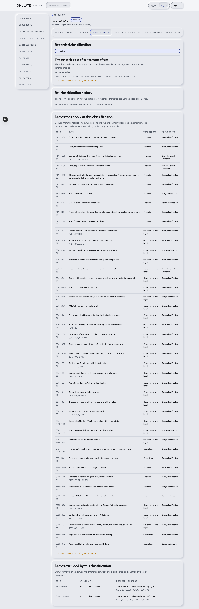

**Founder's conditions / Shart al-Waqif** (`/shart`): the structured record, marked **immutable**. There is no edit control on this screen and no mutation at any API path. A "would halt" advisory shows what the engine would refuse on this deed.

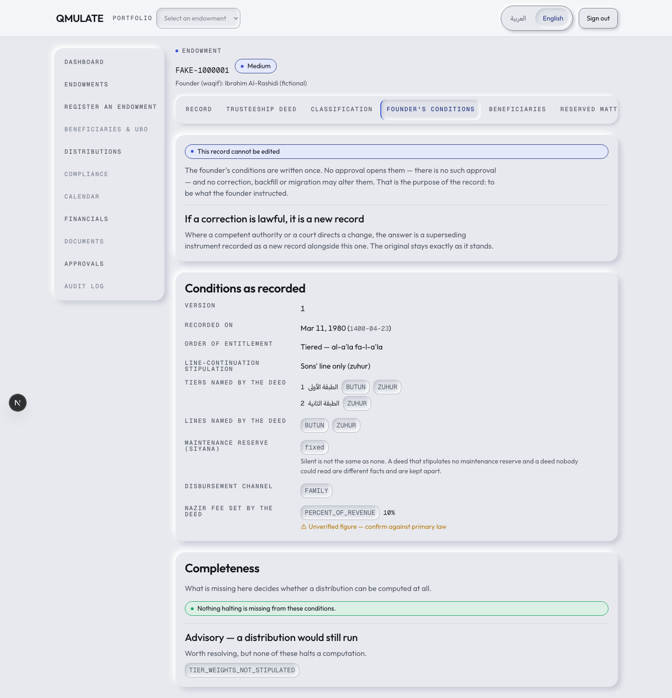

**Beneficiaries** (`/beneficiaries`): the registry, KYC labels, and the **lineage tree** derived from recorded parent edges. Use `waqf-005` for the 16-member, three-generation tree; the integrity panel is all-clear when derived tiers agree with the recorded ones. A `CATEGORY_ONLY` row without a captured category says *disbursement blocked* on the row.

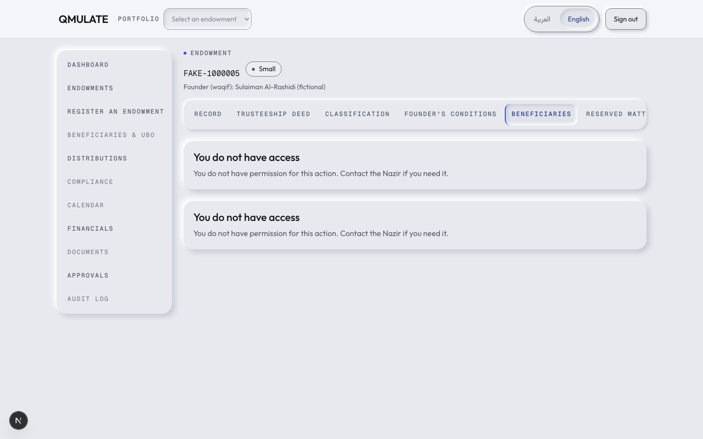

**Negative controls to run alongside:** as `board@example.test` the same record reads, but no create / reclassify / deed-term affordance exists on any endowment screen (there is none for the Nazir either — those acts are reserved matters). As `unscoped@` the list is empty and every record is not-found.

**Automated:** `endowment.spec.ts`, `endowment-journey.spec.ts`, `beneficiaries.spec.ts`, `kernel.spec.ts`.

### 7.3 Register an endowment (intake) — Sprint 12

**Route:** `/en/onboarding` · **Who:** `matrix-admin@example.test` (needs *both* `endowment:waqf:write` and `admin:access_matrix:write` on a **sibling** endowment of the same client — that is what "the family QMULATE already acts for" means in code).

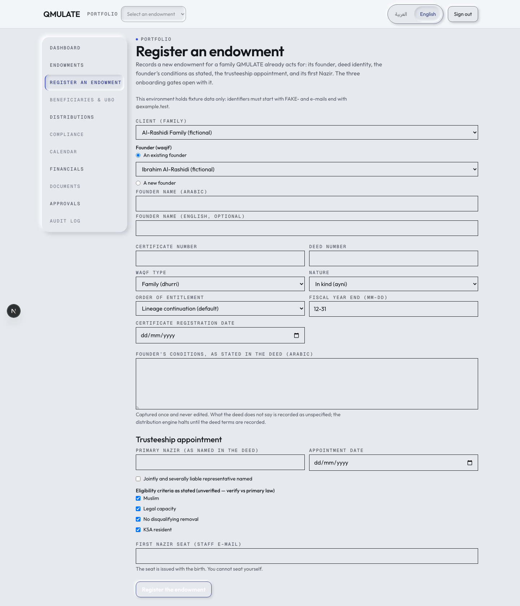

**Steps:**

1. Sign in as `matrix-admin@example.test`, open **Register an endowment** in the sidebar. If the seat had no intake authority, the page would show a notice and **no form** — try it as `nazir@` to see the negative.
2. Client: *Al-Rashidi Family (fictional)*. Founder: pick an existing founder, or *A new founder* and type an Arabic name.
3. Certificate and deed numbers **must start with `FAKE-`** in this environment (e.g. `FAKE-CERT-MANUAL-1`, `FAKE-DEED-MANUAL-1`). Anything else is refused with `FIXTURE_ONLY_IDENTIFIER_REFUSED` — that refusal is the residency guardrail reaching the UI.
4. Type *Family (dhurri)*, nature *In kind*, order of entitlement, fiscal year end, registration date.
5. Founder's conditions as stated in the deed (Arabic). This is written **once**; what the deed does not say is recorded as *unspecified*, and the engine will halt on this endowment until the deed terms are recorded.
6. Trusteeship: primary Nazir as named in the deed, appointment date, eligibility attestations (unverified — verify vs primary law).
7. First Nazir seat: a staff e-mail ending in `@example.test`, e.g. `nazir@example.test`. **You cannot seat yourself** — entering your own e-mail is refused with `SEGREGATION_OF_DUTIES`.
8. **Register the endowment.** You return to this page with a notice carrying the new endowment's id.

**Expected:** the endowment is born `NOT_CLASSIFIED`, with **three OPEN onboarding gates** and both gated activities (distribution runs, Authority filings) blocked. The named Nazir now holds a seat on it; **you do not** — the matrix admin was not seated on the newborn, so `/en/endowments/<newId>` answers not-found for you (non-disclosure by design), while `nazir@` can open it and sees its gates at `/en/endowments/<newId>/onboarding`.

Arabic form: `/ar/onboarding`.

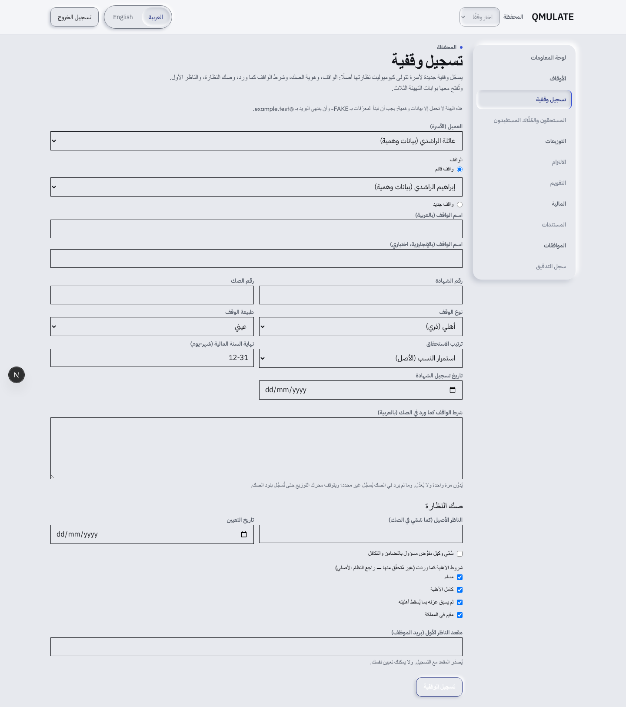

**Automated:** `onboarding-intake.spec.ts`; `onboarding-intake.integration.test.ts` (api); `endowment-birth-admission.integration.test.ts` (database: the `waqf_birth_admission` trigger, born-retired refusal, sibling authority).

### 7.4 Onboarding gates — the three-gate state machine (BR-1101, V-11)

**Route:** `/en/endowments/waqf-004/onboarding` · **Who:** `clerk@example.test` clears; `nazir@example.test` reopens.

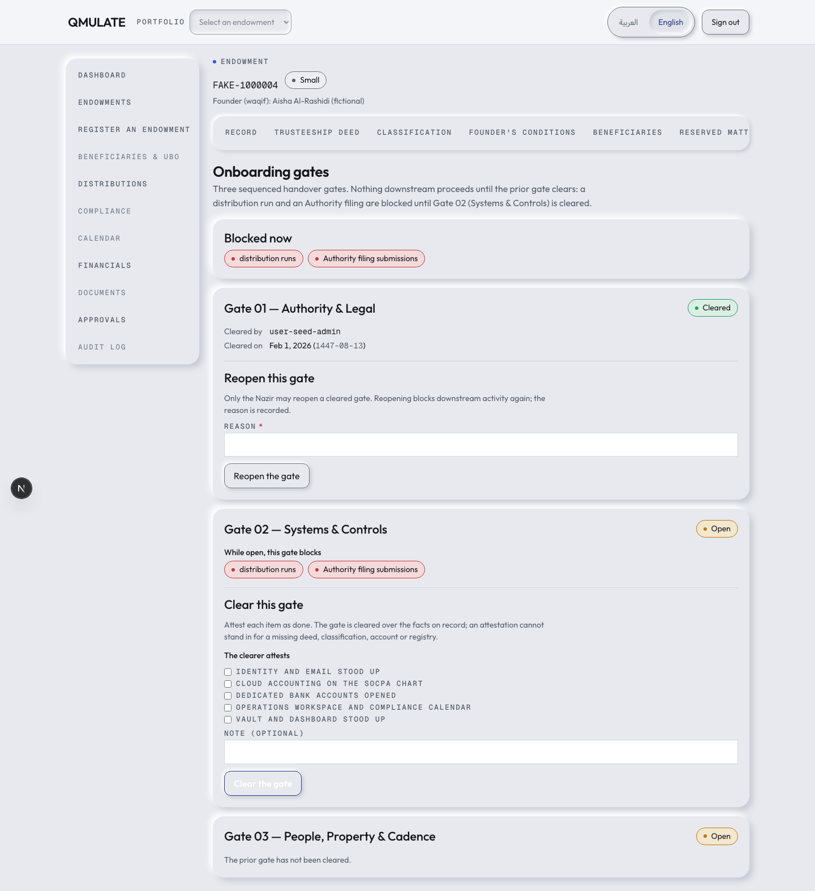

The seed leaves `waqf-004` with **Gate 01 cleared, Gate 02 open, Gate 03 open**. The page states what is *blocked now* (distribution runs, Authority filing submissions) and, per gate, who cleared it and when.

**Clear Gate 02 as the clerk:**

1. Sign in as `clerk@example.test`, open the route above.
2. On *Gate 02 — Systems & Controls*, tick all **five** attestations (identity and e-mail, cloud accounting on the SOCPA chart, dedicated bank accounts, operations workspace and compliance calendar, vault and dashboard). The *Clear the gate* button enables only when all five are ticked.
3. Save. The notice reads *gate cleared*; Gate 02 shows **Cleared by `user-reserved-clerk-001`**; *Blocked now* becomes *nothing is blocked*; Gate 03's form now appears (it was refused with *the prior gate has not been cleared* before).

**Order is enforced both ways:** you cannot clear Gate 03 before Gate 02, and reopening Gate 02 re-blocks downstream activity.

**Reopen as the Nazir:** as `nazir@`, a cleared gate shows *Reopen this gate* with a mandatory **reason**. The clerk sees no reopen form — *only the Nazir may reopen a cleared gate* (owner ruling: "nazir can reopen").

**V-11 by hand:** with Gate 02 open, an Authority filing submission or a distribution-run submission on `waqf-004` is refused with `ONBOARDING_GATE_NOT_CLEARED` ("This endowment has not cleared onboarding Gate 02 (Systems & Controls), so distributions and Authority filings…"). Clear the gate, repeat, and it goes through.

**Automated:** `onboarding-gate.spec.ts` (V-11 in the browser), `packages/api/test/onboarding-gate.integration.test.ts`, `packages/database/test/onboarding-gate.integration.test.ts` (order both directions, no delete/truncate, trigger census).

### 7.5 Reserved matters — the BR-1102 chain

**Route:** `/en/endowments/waqf-004/reserved-matters` · **Who:** `clerk@example.test` records the chain steps; the **sign is the Nazir's**.

The nine reserved-matter kinds are `ASSET_DISPOSAL`, `ASSET_SUBSTITUTION_ISTIBDAL`, `ASSET_PLEDGE`, `ASSET_LONG_LEASE`, `DEED_IDENTITY`, `DEED_TERM_RECORD`, `ACCESS_MATRIX_CHANGE`, `CLASSIFICATION_RETURN_TO_NOT_CLASSIFIED`, `RECEIPT_CLASS_CORRECTION`. The Shart al-Waqif is **not** among them: there is no kind that opens the founder's conditions, by design.

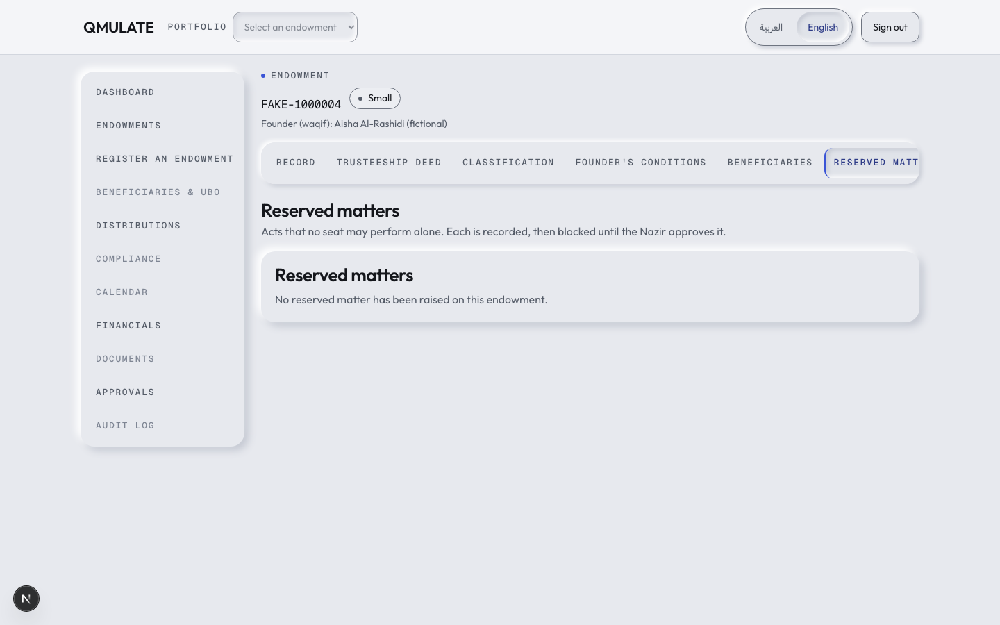

Nothing is raised in the fixture. **There is no UI to raise a reserved matter yet** (§9); the E2E journey raises one through the API and so must you. While signed in as the clerk, paste this into the browser console on any app page:

```js
await fetch('/api/trpc/approval.initiate', {
  method: 'POST',
  headers: { 'content-type': 'application/json', 'x-qmulate-locale': 'en' },
  body: JSON.stringify({
    waqfId: 'waqf-004',
    type: 'RESERVED_MATTER',
    reservedMatterKind: 'DEED_IDENTITY',
    subjectId: 'waqf:waqf-004:manual:' + Date.now(),
    payload: { kind: 'manual.test', waqfId: 'waqf-004', locale: 'en', note: 'manual test (بيانات وهمية)' },
  }),
}).then((r) => r.json());
```

**Expected on the page after a reload:**

1. A card for the matter, badged **Blocked**, stating *chain enforced*, and a *sign blocked* panel naming the two missing steps: **Principal consent** and **Counsel review**.
2. One form per missing step. Enter a reference (a document or minute number, `FAKE-…`) and save. The notice reads *chain step recorded*; that step shows as recorded with who and when.
3. After both steps, the panel flips to *sign ready*. **The clerk still cannot sign** — the sign is the Nazir's approval, and the person who raised the matter cannot approve it (`SEGREGATION_OF_DUTIES`). Sign in as `nazir@` to see the ready state; approval happens through the approvals path (§7.7's approve verb).

**Database wall behind the screen:** even a privileged direct write cannot execute a reserved matter without all three steps recorded (migration 51). The chain is a wall, not a form validation.

**Automated:** `reserved-chain.spec.ts`; `reserved-matter-chain.integration.test.ts` (database); the `reserved-matter-surface` and `labels` pins (9 of 9 kinds in both catalogues).

### 7.6 Approvals queue

**Route:** `/en/approvals` · **Who:** any seat with `approval:request:read` (nazir, both admins, board, auditor, finance…).

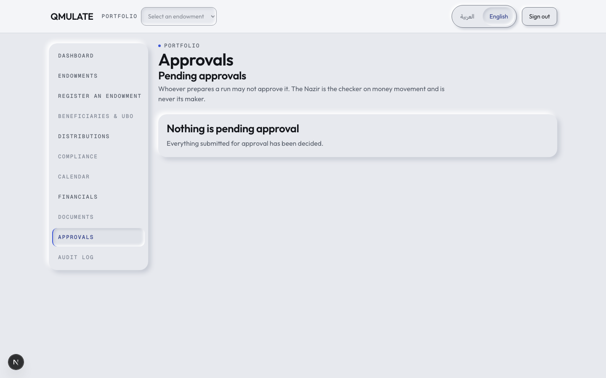

Empty **by fact** in the fixture: the seeded `dist-001` approval is already terminal. The queue fills when the accountant submits a run (§7.7) or a reserved matter is raised (§7.5). Each row names the maker; a row you raised yourself is marked and cannot be approved by you.

### 7.7 Distribution run — compute, submit, approve, execute

**Routes:** `/en/distributions` → `/en/distributions/waqf-001` → `/new?periodStart=2026-01-01&periodEnd=2026-03-31&step=period|waterfall|lines|review` · **Who:** `accountant@example.test` computes and submits; `nazir@` or `approver@` approves and executes.

The wizard's whole state is in the URL, so a step is a navigation. Sign in as the accountant and walk `waqf-001` for the period 2026-01-01 → 2026-03-31:

1. **Period** — the fiscal window and the 3-month post-FYE deadline (unverified figure).

   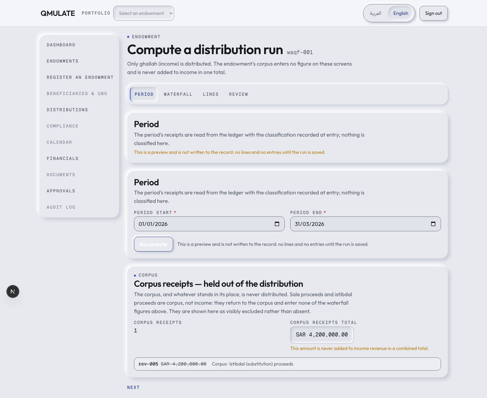

2. **Waterfall** — ṣiyāna reserved **first**, then operating costs, then the Nazir fee (10 % of revenue by *this* deed, not statute), then the distributable. Only income enters. Check the header sentence: *"Only ghallah (income) is distributed. The endowment's corpus enters no figure on these screens."*

   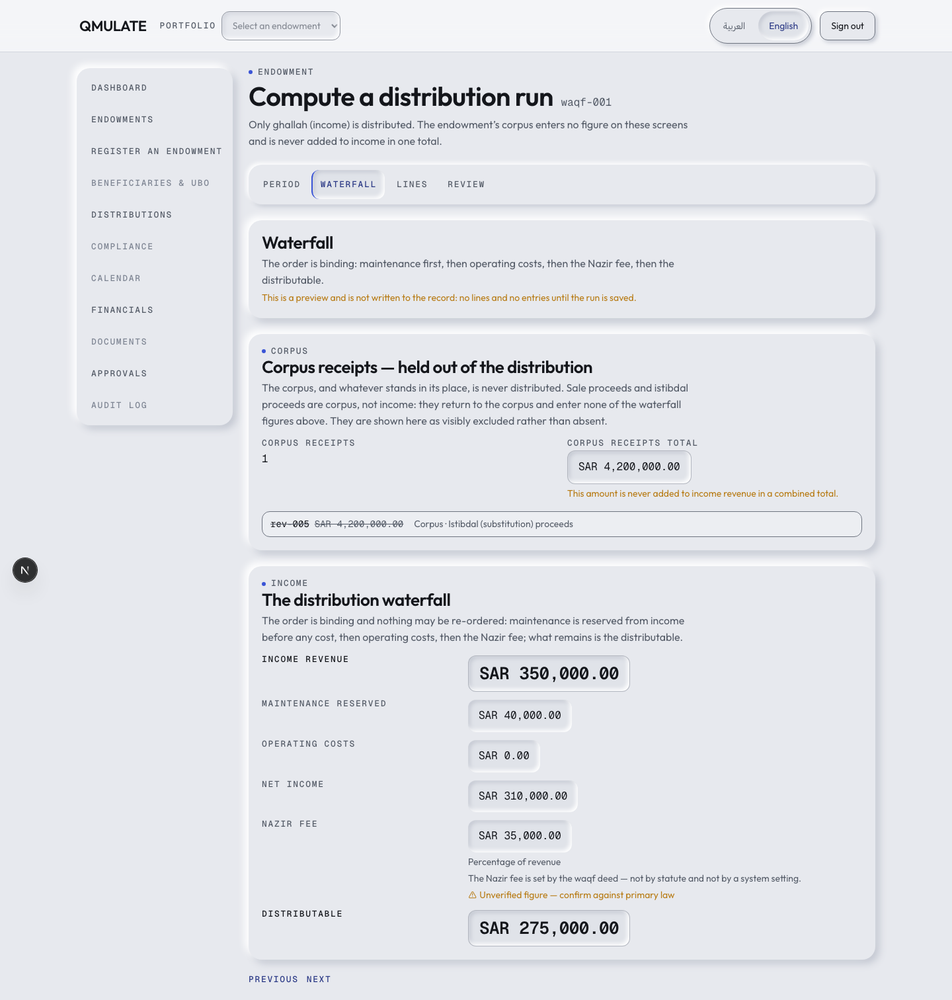

3. **Lines** — one line per beneficiary with **how this line was decided**: rule, tier, reason. On `waqf-001`: `ben-001` *Paid*, `ben-002` *Excluded* (`UPPER_TABAQA_EXTANT` — a lower tier while an upper one lives), `ben-003` **Withheld** (`KYC_UNVERIFIED`; G-4 — the line exists, the payment does not).

   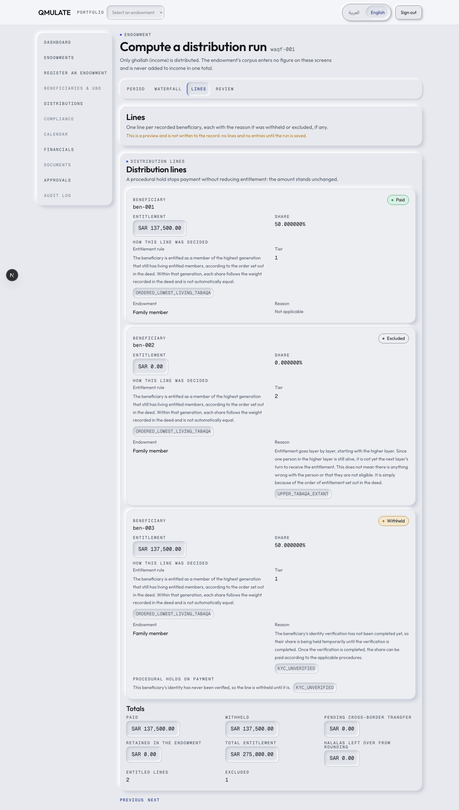

4. **Review** — the corpus receipt **`rev-005` (istibdal proceeds, SAR 4,200,000) visibly held out** of the distribution (V-1); totals; the engine version and run digest; the entitlement rule; the invariants asserted and — separately — the invariants this run makes **no claim about**; a computation trace step by step. *"This is a preview and is not written to the record."*

   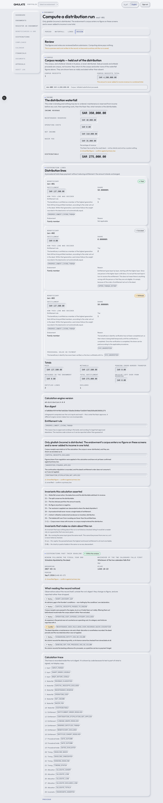

5. **Submit** the run. Its status becomes *pending approval*; it appears in the approvals queue and in the KPI tile *Runs awaiting approval*. **You cannot approve it** as the accountant (no `distribution:run:approve`).
6. Sign in as `approver@example.test` (or `nazir@`), open the run from `/en/distributions/waqf-001` and **approve**. Try approving as the same person who submitted: `SEGREGATION_OF_DUTIES` — "You raised this request, so you cannot approve it. It needs a different Nazir." (G-3).
7. **Execute** as a Nazir seat. The run becomes *executed*; the maker/checker panel names two different identities.

The seeded historical run shows what a stored run looks like: `/en/distributions/waqf-001/runs/dist-001` — maker `user-accountant-001`, checker `user-approver-001`, the stored waterfall and lines, and a trace that records the fixture's own internal inconsistency rather than repairing it.

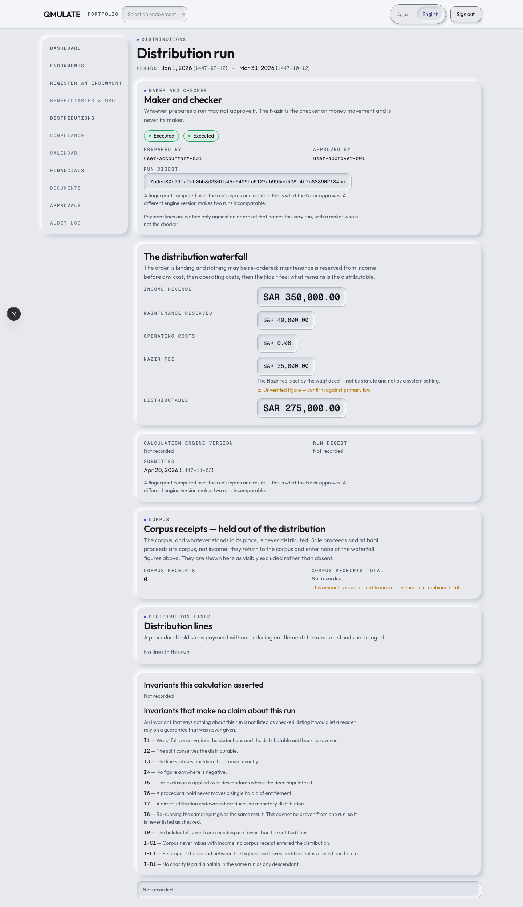

**Two refusals worth seeing:**

- `waqf-005` **halts**: `/en/distributions/waqf-005/new?…&step=review` → *The calculation stopped* — `REVERSION_CLAUSE_UNREAD`, "Nothing is estimated — the conditions must be resolved first." `SHART_INCOMPLETE` in the product's words: the engine never guesses (Binding rule 1).

  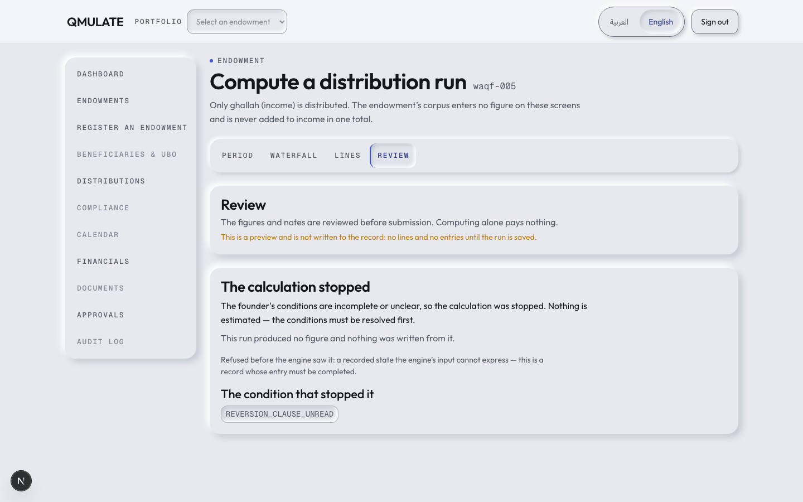

- `waqf-004` while Gate 02 is open: submitting is refused with `ONBOARDING_GATE_NOT_CLEARED` (V-11).

**Lineage deed:** `waqf-007`'s lines step shows the default lineage rule — per capita over the living frontier of each line, the approved wording.

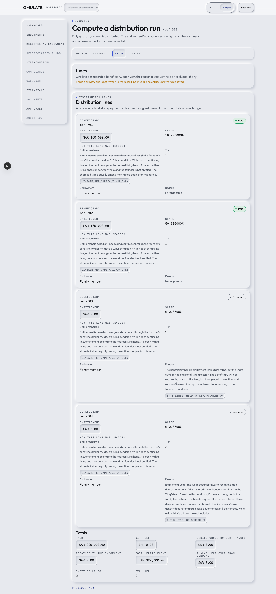

**Negative control:** as `unscoped@` every distribution surface is not-found; signed out, every one redirects to sign-in.

**Automated:** `distribution.spec.ts` (6 journeys), the ~2,160-test domain suite, `distribution-run-schema` and `approval-decision-plane` integration suites.

### 7.8 Financials

**Route:** `/en/financials`, `/en/financials?waqf=<id>` · **Who:** `auditor@example.test` (read-only: two verbs of seventeen), `nazir@`, `accountant@`.

Every blended figure sits beside its **corpus companion**; capital receipts are counted and totalled but never blended into income; a direct-use endowment (`waqf-004`) *states* direct utilization instead of rendering zeros; anything not modelled in this release is declared *owed* (reconciliation, statements) rather than shown as a zero.

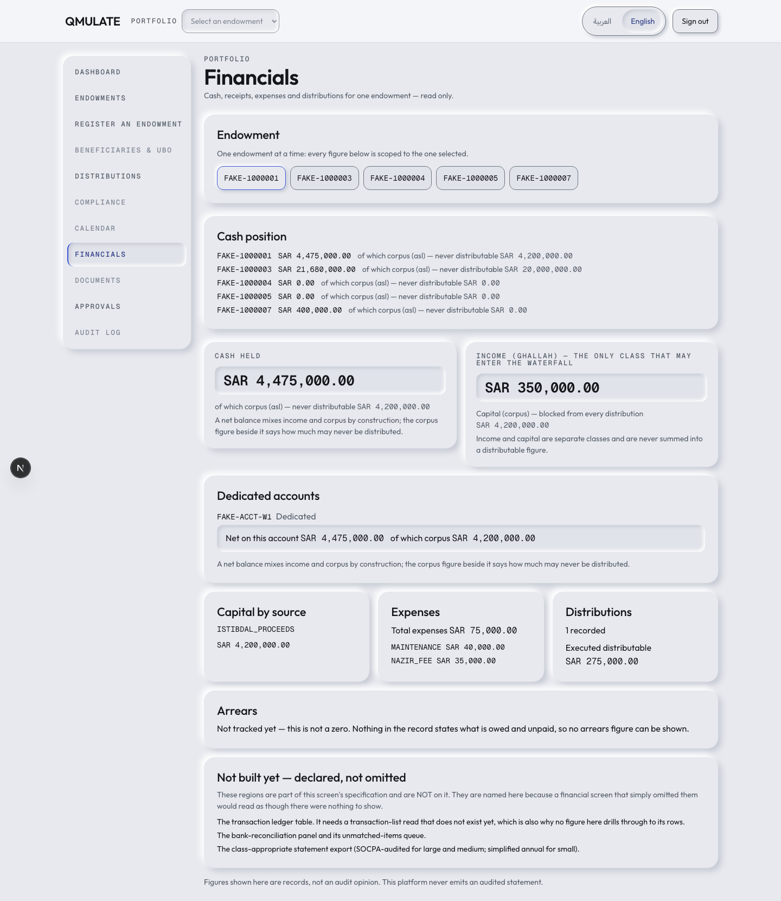

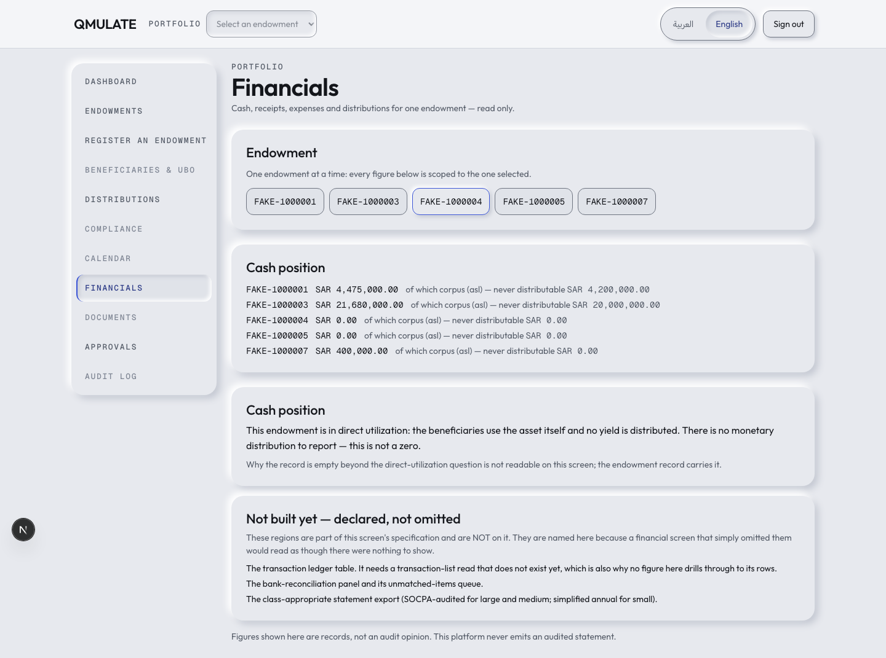

**Receipt capture is API-only** (there is no finance capture form yet, §9). Every `REVENUE` row must carry a class — income or capital — at entry; the database refuses an unclassified receipt.

**Automated:** `financials-journey.spec.ts`; the ledger's integration suites (G-2 composite FKs, receipt-class CHECK).

### 7.9 Access matrix — deny by default (G-7)

Run these three in sequence; they are the cheapest security check in the product.

1. **`unscoped@example.test`** — a valid, TOTP-enrolled session with zero grants. `/en/dashboard` and `/en/endowments` both answer **"You do not have access — That record was not found."** Nothing about the portfolio is disclosed, not even that endowments exist.

   

2. **`beneficiary.ben-001@example.test`** — seated on `waqf-001` for its own record. The dashboard shows exactly one endowment in scope and **"Read refused for this seat"** on four of five indicators; `/en/endowments/waqf-001/deed` reads (owner ruling Q-E4-1); every other endowment is not-found; the ledger and co-beneficiaries are never reachable.

   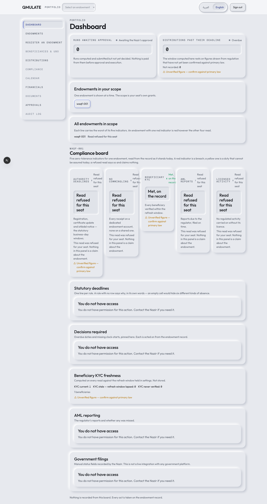

3. **`admin@example.test`** — platform administrator with **no endowment grant**. Same not-found on `/en/endowments`: administrative authority is not a grant, and nothing in the access matrix is satisfied by "the admin has a grant".

   

**Positive control for all three:** `nazir@` sees the whole hierarchy on the same routes (§7.2).

**Automated:** `kernel.spec.ts`, `endowment.spec.ts`, `endowment-journey.spec.ts`, `grant-escalation`, `router-introspection` (the UNSCOPED mutation allowlist is exactly `onboarding.intake`), `base-client-export-surface`.

### 7.10 Locale and RTL

The toggle in the top bar switches `ar` ↔ `en` **preserving the path**. Arabic is the product default. Check: `dir="rtl"` on the root, mirrored layout, no horizontal scroll at any width, focus is a solid ring, the skip link is the first tab stop, numerals and IDs stay LTR islands.

**Automated:** `shell.spec.ts`, `auth.spec.ts`, the i18n parity and Arabic-floor unit suites (every key exists in both catalogues; the Arabic catalogue may not shrink).

## 8 · The importer and the residency guardrail (G-8, V-12) — CLI only

There is no UI. The importer is the fourth layer of the residency guardrail and refuses before it reads anything:

```bash
# Layer 1 — env: production is only legal beside DATA_RESIDENCY=ksa
DATA_CLASSIFICATION=production pnpm --filter @qmulate/database run import --source ./some.json
# → refused: DATA_RESIDENCY must be "ksa" when DATA_CLASSIFICATION is "production"

# Layer 2 — seed refuses anything but fixture-only
DATA_CLASSIFICATION=production pnpm --filter @qmulate/database run seed
# → refused

# Layer 3 — importer refuses a non-production / non-KSA target, the fixture itself as a source,
#           and any source carrying a fictional marker ("Entirely fictional", "بيانات وهمية", "(fictional)")
DATA_CLASSIFICATION=fixture-only pnpm --filter @qmulate/database run import --source data/fixtures/sample-waqf.json
# → IMPORT_REFUSED

# Layer 4 — CI proves all of it: steps G-8a…G-8f in the "Residency guardrail (G-8)" job
```

A dry run (`--dry-run`) prints the plan without applying. Applying runs on the owner connection inside one audited transaction as actor `import:<runId>`; gates are born OPEN; distributions, compliance tasks, settings, users and approvals are deliberately **not** imported.

## 9 · Coverage gaps and what is manual-only

Honest list, as of this commit. None of these is a hidden defect; each is recorded in `docs/product/prd/BUILD-PLAN.md`.

**Not built (nav items rendered greyed, not linked):** a global *Beneficiaries & UBO* screen (per-endowment beneficiaries exist under the record), *Compliance* register screen (the board lives on the dashboard), *Calendar*, *Documents* vault UI (the storage adapter and retention floor exist; the screen does not), *Audit Log* viewer.

**API-only today (no form):** raising a reserved matter (§7.5), recording receipts and bank movements, issuing access-matrix seats, requesting an Authority filing submission. Each has integration coverage; none has a screen.

**TOTP enrolment shows the URI as text**, while the copy says "scan the QR code". Works with "enter a setup key"; a QR image is owed.

**Owner-owed decisions the tests deliberately do not resolve** (Binding rule 4): Q7 option (b) (a brand-new client — the owner-credential importer ships instead), Q8 (a kindless settings change carries no chain), Q4 (the gate checklist wording), the Arabic sign-off on the three S12 screens (intake, gates, reserved matters — their Arabic is drafted, not approved), the E10 P0/P1 exit conflict, the five registration dates, Q3 (maintenance when the deed is silent), zakat, the four edge receipt types.

**Known manual-only checks:** visual RTL quality beyond what `shell.spec.ts` asserts; the wording of every Arabic screen (product-approved legal text must not be invented in a code change); anything printable (no printable statement exists yet; the HQ city is unresolved and must not be printed).

**No performance or load tests exist.** No visual-regression suite exists. Accessibility is asserted structurally (hit targets, focus ring, skip link, `lang`/`dir`), not audited.

## 10 · Regenerating the screenshots

`docs/testing/screenshots.mts` is the harness that took every image in this folder: it signs in through the real UI as each seat, enrols TOTP on first use (storing each secret in a scratch JSON so a rerun can pass the challenge), and screenshots a fixed list of routes at 1440 px. With the §4 stack running on port 3100:

```bash
SCRATCH=/tmp/qm-shots pnpm --filter web exec tsx ../../docs/testing/screenshots.mts          # every seat
SCRATCH=/tmp/qm-shots pnpm --filter web exec tsx ../../docs/testing/screenshots.mts nazir    # one seat
```

It imports Playwright from `apps/web`'s own dependency tree, so it needs no install of its own. Because TOTP enrolment is one-way, run it against a **fresh `--reset` cluster** or keep the scratch secrets file from the run that enrolled the seats.

**The printed hand-out** (`docs/testing/TESTING-GUIDE.pdf`) is built from this file by `docs/testing/build-pdf.mts`. It embeds *viewport-only* screenshots (1440 × 1400, taken with `FULLPAGE=0 VIEWPORT_H=1400 OUT=<dir>`), because the full-page images in this folder are too tall to print legibly:

```bash
mkdir -p /tmp/qm-print && cd apps/web
FULLPAGE=0 VIEWPORT_H=1400 OUT=/tmp/qm-print SCRATCH=/tmp/qm-shots pnpm exec tsx ../../docs/testing/screenshots.mts
SHOTS=/tmp/qm-print pnpm exec tsx ../../docs/testing/build-pdf.mts
```

Rebuild the PDF whenever this file or the screens change; the PDF is the copy handed to users, this file is the source.

---

*Sources of truth this document summarises: `docs/product/prd/17-build-ship-dod.md` (gates, scenarios), `docs/product/prd/BUILD-PLAN.md` (the sprint rows and their measurements), `apps/web/e2e/*.spec.ts` (the journeys), `packages/database/src/seed/map.ts` (the seats), `packages/domain/src/access.ts` (the role presets), `.github/workflows/ci.yml` (the jobs). When they disagree with this page, they win — update this page.*
